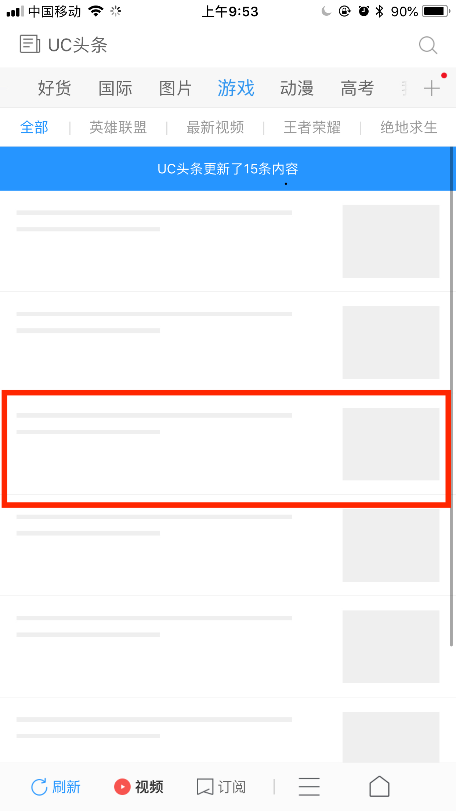

## 题目需求
 - 切换头部导航栏选项，下方内容区域对应更新
 - 在一次访问周期内，如果页面之前被访问过，再次被访问时定位到上次访问的位置

## 题目要求
 - 在已有代码基础上完成上述功能

 - 也可选择一个方向进行优化，使之成为此类型的最佳实践，可选方向：

    - 手机端，一直下拉刷新dom过多后的卡顿情况
    - 加载体验优化，当接口返回时间较长时，实现类似以下效果  
    
    - 组件抽象和使用方式
    - 切换动画
    - 。。。

## 总结
- 监听路由变化的方式
    - `<router-view :key="$route.path"></router-view>` 这种方式会让router-view 中的组件每次都重新渲染，无法记录里面的状态,比如p值等

- 共享一个window scroll事件，当一个unbind之后，后续的如何处理，`:key="$route.path`生产多个滚动监听，但是名字是一个，所以要为每个scroll单独命名一个名字。

